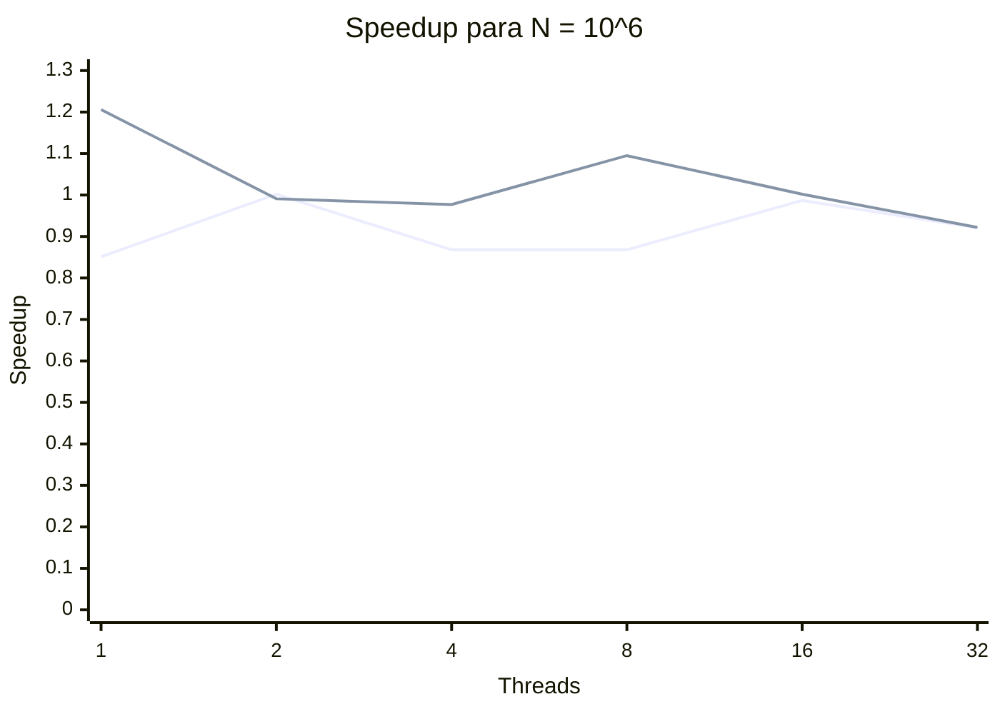
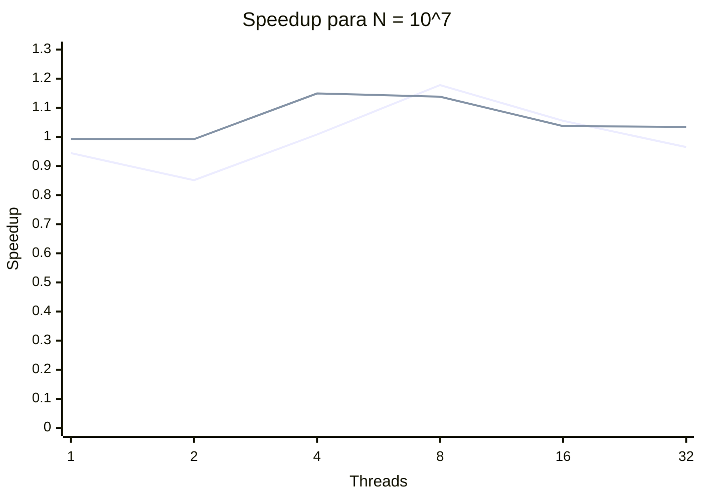
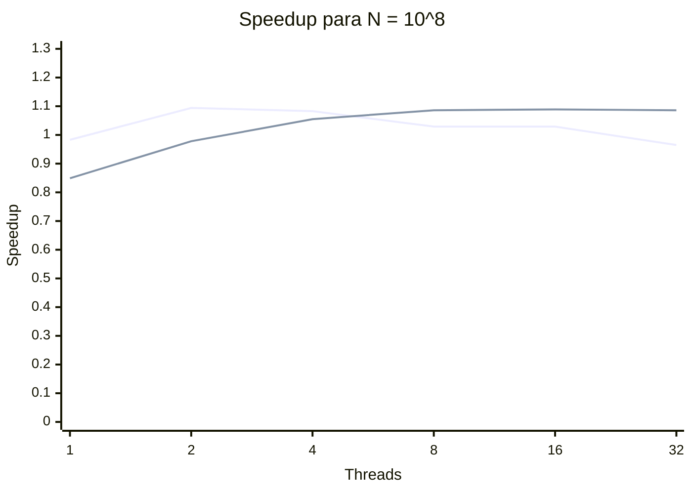

# Laboratorio 1: ¿Más procesadores significa mayor velocidad?

## Resumen

Se compararon tres implementaciones de la suma de un vector de `double`:

| Archivo fuente | Implementación | Ejecutable |
|---|---|---|
| `suma_secuencial.cpp` | Secuencial | `suma_secuencial` |
| `suma_threads.cpp` | Threads nativos de C++ | `suma_threads` |
| `suma_openmp.cpp` | OpenMP | `suma_openmp` |

La notación solicitada como `n^6`, `n^7` y `n^8` se interpretó según el PDF como `N=10^6`, `N=10^7` y `N=10^8` elementos.

## Cambios realizados

- Se cambiaron los nombres de los archivos y de los identificadores para describir su función.
- Los tres programas reciben la cantidad de datos por argumento.
- `suma_threads` recibe además la cantidad de threads y reparte correctamente el resto cuando `N` no es divisible entre ellos.
- `suma_openmp` recibe además la cantidad de threads mediante `omp_set_num_threads` y usa `reduction`.
- Se añadió medición con `std::chrono::steady_clock` en los tres programas.
- El tiempo medido incluye la creación e inicialización del vector, la suma y, en la versión con threads nativos, la creación y unión de los threads.
- Todas las ejecuciones produjeron `result=N`.

## Equipo y condiciones

- CPU: `12th Gen Intel(R) Core(TM) i5-1235U`
- CPUs lógicas disponibles: `12` (`10` núcleos por socket reportados por el sistema, `2` hilos por núcleo)
- Memoria RAM total observada: `15 GiB`
- Tamaños usados: `10^6` (8 MB), `10^7` (80 MB) y `10^8` (800 MB)
- Threads: `1, 2, 4, 8, 16, 32`
- Repeticiones por combinación: `3`
- Compilador: `g++`, estándar C++17, optimización `-O2`

El comando `/usr/bin/time` no está instalado en este entorno. Por ello, todas las tablas usan la medición interna con `std::chrono`, que ofrece resolución de submilisegundos y evita depender de la salida localizada del comando externo. El comando `time` del shell se probó como comprobación adicional.

## Compilación

```bash
g++ -std=c++17 -O2 -Wall -Wextra -pedantic suma_secuencial.cpp -o suma_secuencial
g++ -std=c++17 -O2 -Wall -Wextra -pedantic -pthread suma_threads.cpp -o suma_threads
g++ -std=c++17 -O2 -Wall -Wextra -pedantic -fopenmp suma_openmp.cpp -o suma_openmp
```

## Comandos de ejecución

```bash
./suma_secuencial 1000000
./suma_threads 1000000 8
./suma_openmp 1000000 8
```

Cada programa imprime una línea de la forma:

```text
result=1000000 elapsed_seconds=0.003995041
```

## Fórmulas

Para cada tamaño se tomó como `T1` el promedio de la versión secuencial:

```text
Speedup(p) = T_secuencial / T_paralelo(p)
Eficiencia(p) = Speedup(p) / p
```

Usar el mismo `T_secuencial` para ambas versiones paralelas permite comparar directamente contra la solución base. Cada tiempo de las tablas paralelas es el promedio de tres ejecuciones.

## Tiempos promedio, speedup y eficiencia

### N = 10^6

Tiempo secuencial de referencia: **0.003995041 s**.

| Implementación | Threads | Tiempo promedio (s) | Speedup | Eficiencia |
|---|---:|---:|---:|---:|
| Threads C++ | 1 | 0.004695710 | 0.851 | 0.851 |
| Threads C++ | 2 | 0.003986024 | 1.002 | 0.501 |
| Threads C++ | 4 | 0.004602832 | 0.868 | 0.217 |
| Threads C++ | 8 | 0.004604628 | 0.868 | 0.108 |
| Threads C++ | 16 | 0.004045664 | 0.987 | 0.062 |
| Threads C++ | 32 | 0.004338251 | 0.921 | 0.029 |
| OpenMP | 1 | 0.003311679 | 1.206 | 1.206 |
| OpenMP | 2 | 0.004032796 | 0.991 | 0.495 |
| OpenMP | 4 | 0.004087718 | 0.977 | 0.244 |
| OpenMP | 8 | 0.003647210 | 1.095 | 0.137 |
| OpenMP | 16 | 0.003987381 | 1.002 | 0.063 |
| OpenMP | 32 | 0.004332026 | 0.922 | 0.029 |



### N = 10^7

Tiempo secuencial de referencia: **0.033897819 s**.

| Implementación | Threads | Tiempo promedio (s) | Speedup | Eficiencia |
|---|---:|---:|---:|---:|
| Threads C++ | 1 | 0.035923175 | 0.944 | 0.944 |
| Threads C++ | 2 | 0.039815716 | 0.851 | 0.426 |
| Threads C++ | 4 | 0.033614997 | 1.008 | 0.252 |
| Threads C++ | 8 | 0.028770518 | 1.178 | 0.147 |
| Threads C++ | 16 | 0.032133576 | 1.055 | 0.066 |
| Threads C++ | 32 | 0.035132102 | 0.965 | 0.030 |
| OpenMP | 1 | 0.034133064 | 0.993 | 0.993 |
| OpenMP | 2 | 0.034182605 | 0.992 | 0.496 |
| OpenMP | 4 | 0.029512748 | 1.149 | 0.287 |
| OpenMP | 8 | 0.029791093 | 1.138 | 0.142 |
| OpenMP | 16 | 0.032679524 | 1.037 | 0.065 |
| OpenMP | 32 | 0.032777421 | 1.034 | 0.032 |



### N = 10^8

Tiempo secuencial de referencia: **0.309672868 s**.

| Implementación | Threads | Tiempo promedio (s) | Speedup | Eficiencia |
|---|---:|---:|---:|---:|
| Threads C++ | 1 | 0.315108058 | 0.983 | 0.983 |
| Threads C++ | 2 | 0.282969804 | 1.094 | 0.547 |
| Threads C++ | 4 | 0.285988210 | 1.083 | 0.271 |
| Threads C++ | 8 | 0.301049068 | 1.029 | 0.129 |
| Threads C++ | 16 | 0.301078151 | 1.029 | 0.064 |
| Threads C++ | 32 | 0.320992549 | 0.965 | 0.030 |
| OpenMP | 1 | 0.364962403 | 0.849 | 0.849 |
| OpenMP | 2 | 0.316784739 | 0.978 | 0.489 |
| OpenMP | 4 | 0.293473620 | 1.055 | 0.264 |
| OpenMP | 8 | 0.285181901 | 1.086 | 0.136 |
| OpenMP | 16 | 0.284284471 | 1.089 | 0.068 |
| OpenMP | 32 | 0.285254198 | 1.086 | 0.034 |



En cada gráfica, la primera línea corresponde a Threads C++ y la segunda a OpenMP.

## Mediciones individuales

Los valores siguientes son las tres repeticiones usadas para calcular cada promedio. Todos los resultados fueron iguales a `N`.

| Implementación | N | Threads | Repetición 1 (s) | Repetición 2 (s) | Repetición 3 (s) | Promedio (s) |
|---|---:|---:|---:|---:|---:|---:|
| Secuencial | 10^6 | 1 | 0.003606778 | 0.003788516 | 0.004589830 | 0.003995041 |
| Threads C++ | 10^6 | 1 | 0.005309649 | 0.005007169 | 0.003770313 | 0.004695710 |
| Threads C++ | 10^6 | 2 | 0.004218587 | 0.004230752 | 0.003508734 | 0.003986024 |
| Threads C++ | 10^6 | 4 | 0.004527893 | 0.004458995 | 0.004821608 | 0.004602832 |
| Threads C++ | 10^6 | 8 | 0.003855919 | 0.004726169 | 0.005231796 | 0.004604628 |
| Threads C++ | 10^6 | 16 | 0.004265664 | 0.003969502 | 0.003901827 | 0.004045664 |
| Threads C++ | 10^6 | 32 | 0.004561525 | 0.003914343 | 0.004538884 | 0.004338251 |
| OpenMP | 10^6 | 1 | 0.003880395 | 0.003218548 | 0.002836094 | 0.003311679 |
| OpenMP | 10^6 | 2 | 0.004048480 | 0.003493905 | 0.004556003 | 0.004032796 |
| OpenMP | 10^6 | 4 | 0.004290524 | 0.003830172 | 0.004142457 | 0.004087718 |
| OpenMP | 10^6 | 8 | 0.003227934 | 0.004490263 | 0.003223433 | 0.003647210 |
| OpenMP | 10^6 | 16 | 0.003511801 | 0.004216704 | 0.004233638 | 0.003987381 |
| OpenMP | 10^6 | 32 | 0.004606670 | 0.004382463 | 0.004006945 | 0.004332026 |
| Secuencial | 10^7 | 1 | 0.033093540 | 0.036475741 | 0.032124175 | 0.033897819 |
| Threads C++ | 10^7 | 1 | 0.034529527 | 0.036812534 | 0.036427464 | 0.035923175 |
| Threads C++ | 10^7 | 2 | 0.040540366 | 0.039777129 | 0.039129654 | 0.039815716 |
| Threads C++ | 10^7 | 4 | 0.035144284 | 0.035769456 | 0.029931250 | 0.033614997 |
| Threads C++ | 10^7 | 8 | 0.027196695 | 0.027459870 | 0.031654989 | 0.028770518 |
| Threads C++ | 10^7 | 16 | 0.032822773 | 0.030462071 | 0.033115883 | 0.032133576 |
| Threads C++ | 10^7 | 32 | 0.032863257 | 0.037827422 | 0.034705626 | 0.035132102 |
| OpenMP | 10^7 | 1 | 0.036174733 | 0.031758503 | 0.034465957 | 0.034133064 |
| OpenMP | 10^7 | 2 | 0.030453446 | 0.037872261 | 0.034222107 | 0.034182605 |
| OpenMP | 10^7 | 4 | 0.030407257 | 0.032648620 | 0.025482368 | 0.029512748 |
| OpenMP | 10^7 | 8 | 0.029067178 | 0.027530116 | 0.032775985 | 0.029791093 |
| OpenMP | 10^7 | 16 | 0.038303684 | 0.032778163 | 0.026956724 | 0.032679524 |
| OpenMP | 10^7 | 32 | 0.033851904 | 0.031478336 | 0.033002024 | 0.032777421 |
| Secuencial | 10^8 | 1 | 0.297117665 | 0.323222355 | 0.308678584 | 0.309672868 |
| Threads C++ | 10^8 | 1 | 0.342037469 | 0.299839290 | 0.303447415 | 0.315108058 |
| Threads C++ | 10^8 | 2 | 0.279048777 | 0.278075555 | 0.291785080 | 0.282969804 |
| Threads C++ | 10^8 | 4 | 0.278457095 | 0.288568942 | 0.290938593 | 0.285988210 |
| Threads C++ | 10^8 | 8 | 0.278488082 | 0.324302466 | 0.300356655 | 0.301049068 |
| Threads C++ | 10^8 | 16 | 0.295357996 | 0.303985249 | 0.303891207 | 0.301078151 |
| Threads C++ | 10^8 | 32 | 0.286110374 | 0.323444793 | 0.353422479 | 0.320992549 |
| OpenMP | 10^8 | 1 | 0.382725337 | 0.371423836 | 0.340738036 | 0.364962403 |
| OpenMP | 10^8 | 2 | 0.304747596 | 0.319516555 | 0.326090067 | 0.316784739 |
| OpenMP | 10^8 | 4 | 0.312819365 | 0.289151862 | 0.278449633 | 0.293473620 |
| OpenMP | 10^8 | 8 | 0.277596338 | 0.280790163 | 0.297159203 | 0.285181901 |
| OpenMP | 10^8 | 16 | 0.282659955 | 0.277356954 | 0.292836503 | 0.284284471 |
| OpenMP | 10^8 | 32 | 0.278680562 | 0.290908656 | 0.286173376 | 0.285254198 |

## Respuestas de análisis

1. **¿Qué parte puede ejecutarse en paralelo?**

   La lectura de cada elemento y la suma parcial de un bloque son independientes. Al terminar, deben combinarse las sumas parciales en una suma total.

2. **¿Qué problema aparece con una suma compartida?**

   Aparece una condición de carrera: dos threads pueden leer y escribir el mismo valor simultáneamente, perdiendo actualizaciones. `suma_threads` evita esto usando una suma parcial por thread y `suma_openmp` usa `reduction`.

3. **¿El speedup es lineal?**

   No. El mejor resultado fue `1.206x` para OpenMP con `N=10^6`, `1.178x` para threads nativos con `N=10^7`, y `1.094x`/`1.089x` para `N=10^8`. En ningún caso se aproxima a `p` veces más rápido.

4. **¿Desde qué cantidad de threads deja de mejorar significativamente?**

   En `N=10^7`, la mejora máxima aparece alrededor de 4 a 8 threads. En `N=10^8`, threads nativos alcanza su mejor tiempo con 2 threads y OpenMP se estabiliza desde aproximadamente 8 threads. Después, el rendimiento queda plano o empeora.

5. **¿Qué ocurre con más threads que núcleos disponibles?**

   Hay sobre-suscripción: el sistema debe alternar entre más threads que CPUs lógicas disponibles, aumentando la planificación y el cambio de contexto. Los resultados con 16 y 32 threads no mejoran respecto de 2, 4 u 8 threads.

6. **¿Influye el tamaño del problema?**

   Sí, pero no garantiza un speedup grande. Con `N=10^8` el trabajo es suficientemente grande para amortizar parte del overhead y se observan speedups cercanos a `1.09x`; aun así, el acceso a memoria limita la ganancia. Los tamaños pequeños están más afectados por la creación y coordinación de threads.

7. **Dos razones por las que el speedup no crece proporcionalmente**

   - La suma es principalmente limitada por el ancho de banda y la jerarquía de memoria, no por la capacidad de cálculo de la CPU.
   - La creación, coordinación y planificación de threads agrega overhead; además, usar 16 o 32 threads sobre 12 CPUs lógicas produce sobre-suscripción.

## Conclusión

Más threads no significan necesariamente mayor velocidad. En este experimento, la mejor cantidad depende del tamaño del vector y de la implementación: para `N=10^8`, 2 threads nativos y entre 8 y 16 threads OpenMP fueron competitivos, mientras que 32 threads empeoró o no aportó una mejora. La medición y la comparación con la versión secuencial son necesarias para elegir la configuración adecuada.
